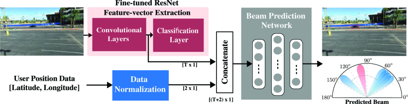
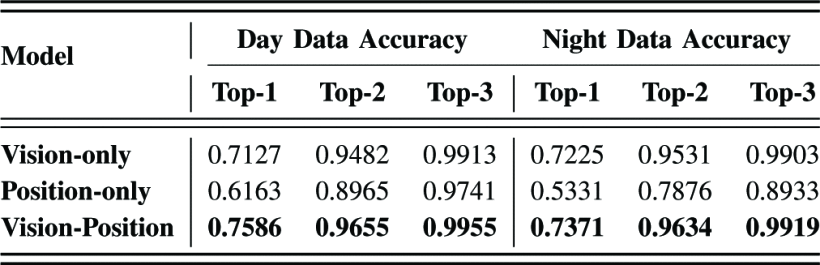

#### 主要贡献：

1. 提出基于视觉与位置融合的多模态机器学习框架，在无需信道状态信息的前提下，实现毫米波/太赫兹波束快速预测。
2. 模型基于真实车辆数据集（DeepSense 6G）进行训练与验证，在Top-3预测准确率上接近100%，显著降低波束训练开销。

#### 采用方法：

文章采取两种模态：视觉模态和位置模态，分别提取图像特征和位置信息，通过融合网络进行联合建模。视觉模态通过 ResNet-50 提取图像特征，位置模态通过 MLP 网络提取特征，最后将两者特征进行拼接 Concat。

#### 实验结果：

采用 Deepsense 6G 数据集中的场景5和场景6进行实验，两种场景分别为白天和黑夜，取得的结果如下：

#### 局限性：

1. GPS位置精度受限，影响纯位置信息预测性能；
2. 模型仅适用于单用户场景，未考虑多用户干扰；
3. 摄像头未采集深度信息，视觉鲁棒性在恶劣天气中待验证；
4. 只考虑静态图像，未建模用户运动或信道时序动态。