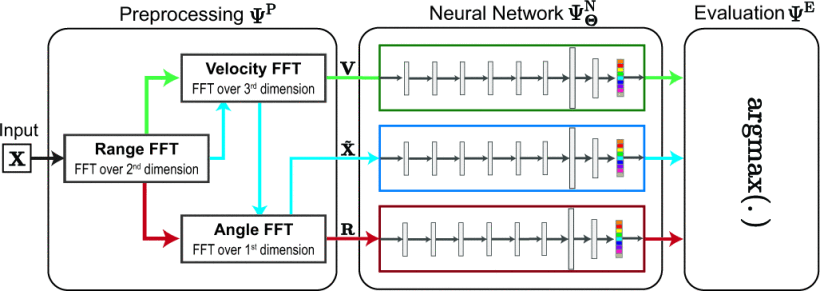
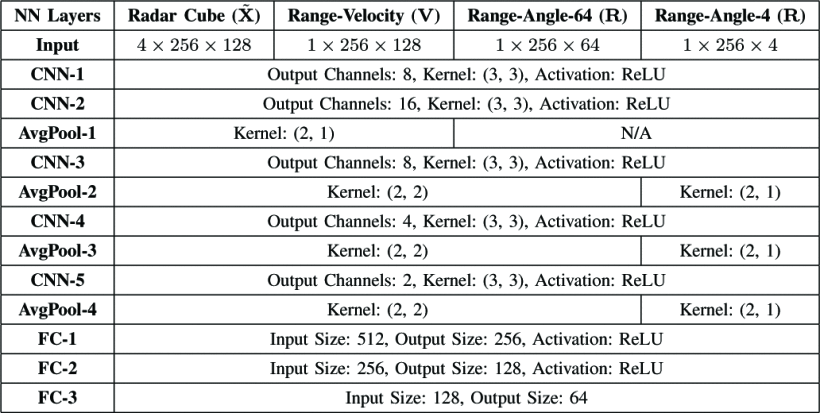
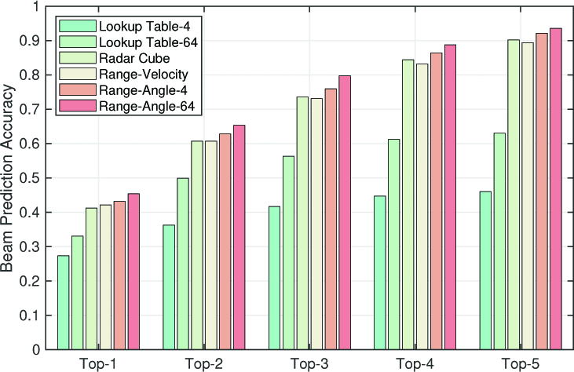
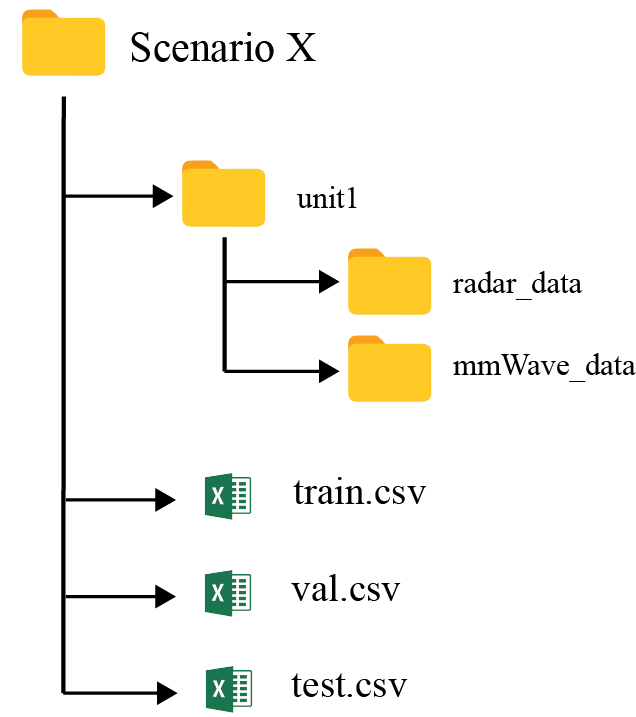

#### 主要贡献：

- 提出首个基于深度学习的毫米波雷达辅助波束预测算法，并在真实车联网场景中完成实证验证。
- 设计多种雷达预处理方法（Range-Angle、Range-Velocity、Radar Cube），结合CNN模型实现从雷达数据到波束的映射。
- 构建毫米波通信与雷达融合的大规模真实数据集，利用 DeepSense 6G 平台进行收集，包含超 6 千条数据样本。
- 在不依赖雷达与通信模块校准的条件下，实现 Top-5 波束预测准确率接近 90%，并将波束训练开销减少约 93%。

#### 采用方法：

1. 系统模型：基站配备 77GHz FMCW 雷达与 60GHz 通信相控阵；用户端采用准全向天线发射。

2. 数据预处理：

   - <strong>Range-Angle Map</strong>：时域FFT + 空域FFT；
   - <strong>Range-Velocity Map</strong>：时域FFT + 脉冲FFT（Doppler）；
   - <strong>Radar Cube</strong>：三维FFT，保留完整时-频-空特征。

3. 模型结构：

   设计轻量CNN网络：5个卷积层 + 平均池化 + 3层全连接，适配不同输入维度（详见 Table II）；损失函数为交叉熵，多分类 Top-K 预测问题。

   

   

#### 实验结果：

1. Range-Angle 模态下 Top-5 波束预测准确率达 <strong>93.5%</strong>，显著优于传统查找表法（<33%）；

2. 模型大小约为 <strong>175K</strong> 参数，推理时延低于 <strong>0.5ms</strong>，预处理耗时受 FFT 分辨率影响显著；

3. 仅使用较少的训练数据即可达到较好效果，Range-Angle Map 对数据需求更低，泛化更强。

   

#### 局限性：

- 数据集中仅使用单用户场景，未评估多用户、多目标干扰下的鲁棒性；
- 模型结构偏轻量，Radar Cube 模态性能受限，未来可探索更深层网络或 Transformer；
- 未引入运动轨迹连续性建模，忽略帧间时序相关性。

#### 代码复现记录报告

对作者开源的代码进行了复现。该代码旨在通过使用雷达数据来进行波束预测，采用卷积神经网络进行分类。任务的目标是基于雷达数据帧（通过三种不同的预处理方法）预测与每个雷达帧对应的波束索引，**本质上是一个64类分类任务**。

下面内容主要记录跑通该开源代码的过程已经最终的实验结果。

**环境配置：**

本项目运行需要具备 GPU 支持的计算机环境，以加速神经网络的训练过程。我们使用了 **NVIDIA GPU** 和 **CUDA** 来进行模型训练。将项目克隆到本地后需要根据`requirements.txt`安装相关依赖。

**数据集：**

该项目使用了 **DeepSense 6G** 提供的雷达数据集。在[Radar-Aided Beam Prediction](https://www.deepsense6g.net/radar-aided-beam-prediction/)下载 Scenario9 数据集，需要注意的是，该数据集是官方为此次任务专门提供的数据集，其中已经对原始的数据进行了拆分：train、val、test。这个和主办方在官网 Dataset 中所提供的 Scenario9 数据集是不一样的。此次需要的数据集结构如下：



数据集下载后直接放在主目录下。

**数据集读取：**

作者将数据集读取以函数形式放在了`dataset.py`文件夹内，并且在`train.py`中进行了调用。

**数据处理：**

在数据预处理阶段，雷达数据会经过不同的变换，以提取关键的特征。项目中实现了三种预处理方法，代码存放在`radar_preprocessing_torch.py`文件中：

1. **Radar Cube**：通过三维雷达数据构建一个雷达立方体。
2. **Range Velocity Map**：构建距离-速度图，表示雷达的不同距离和速度信息。
3. **Range Angle Map**：构建距离-角度图，表示不同的角度和距离信息。

**模型架构：**

本项目使用了卷积神经网络（CNN）进行波束预测。具体使用了 **LeNet** 架构的变体来处理不同类型的雷达数据。对应的三个变体存放在`radar_network_models.py`中，以下是各个网络的详细结构：

1. **LeNet_RadarCube**用于处理 **雷达立方体数据**，该模型由多个卷积层、池化层和全连接层构成。每个卷积层使用 ReLU 激活函数，最终通过全连接层输出波束索引的预测。

2. **LeNet_RangeAngle**用于处理 **距离-角度图数据**，其结构与 `LeNet_RadarCube` 类似，但在卷积层的设置上有所不同，针对距离和角度信息进行优化。

3. **LeNet_RangeVelocity**用于处理 **距离-速度图数据**，结构类似于 `LeNet_RadarCube`，但通过不同的池化层和卷积核来适配速度信息。

以下是 `LeNet_RadarCube` 的模型代码示例：

```python
class LeNet_RadarCube(nn.Module):
    def __init__(self):
        super(LeNet_RadarCube, self).__init__()
        self.conv1 = nn.Conv2d(4, 8, 3, padding='same')
        self.conv2 = nn.Conv2d(8, 16, 3, padding='same')
        self.fc1 = nn.Linear(512, 4*64)
        self.fc2 = nn.Linear(4*64, 2*64)
        self.fc3 = nn.Linear(2*64, 64)

    def forward(self, x):
        x = F.relu(self.conv1(x))
        x = F.relu(self.conv2(x))
        x = torch.flatten(x, start_dim=1)
        x = F.relu(self.fc1(x))
        x = F.relu(self.fc2(x))
        return self.fc3(x)
```

**训练过程：**

有关训练、评估、测试的代码以函数的形式定义在了`network_functions.py`中，并在`train.py`中调用。在`train.py`中启动训练，需要修改两个变量：`root_dir`以及`data_type`：

```python
# Dataset Files
root_dir = './Scenario9/development_dataset'
csv_files = ['scenario9_dev_%s.csv'%s for s in ['train', 'val', 'test']]

# Solution Type Selection
data_type = 0 # 0: Radar Cube / 1: Range Velocity / 2: Range Angle
print('Model/Data Type: %s' % ['Radar Cube', 'Range Velocity', 'Range Angle'][data_type])
```

确定好对应的数据集路径后，选取不同的`data_type`就是选取不同的预处理方法，不同的模型框架进行训练，一共需要完成三次，每次训练完成后会打印评估结果。

**结果分析：**

| **Model Type**     | **Top-1 Accuracy (%)** | **Top-2 Accuracy (%)** | **Top-3 Accuracy (%)** | **Top-4 Accuracy (%)** | **Top-5 Accuracy (%)** | **Beam Distance** |
| ------------------ | ---------------------- | ---------------------- | ---------------------- | ---------------------- | ---------------------- | ----------------- |
| **Radar Cube**     |                        |                        |                        |                        |                        |                   |
| Final Model        | 40.98                  | 59.53                  | 73.36                  | 82.46                  | 89.04                  | 1.45              |
| **Range Velocity** |                        |                        |                        |                        |                        |                   |
| Final Model        | 42.50                  | 59.70                  | 72.01                  | 80.78                  | 88.36                  | 1.40              |
| **Range Angle**    |                        |                        |                        |                        |                        |                   |
| Final Model        | 44.69                  | 66.95                  | 80.27                  | 88.70                  | 94.10                  | 1.15              |