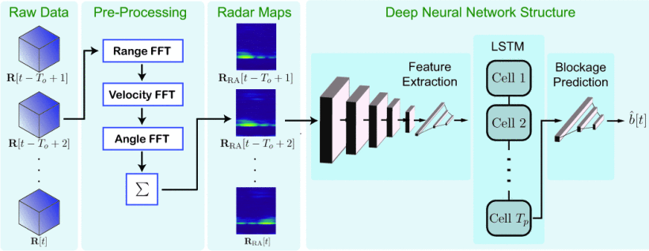
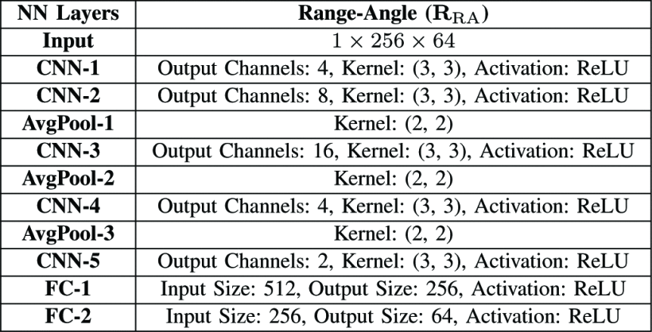
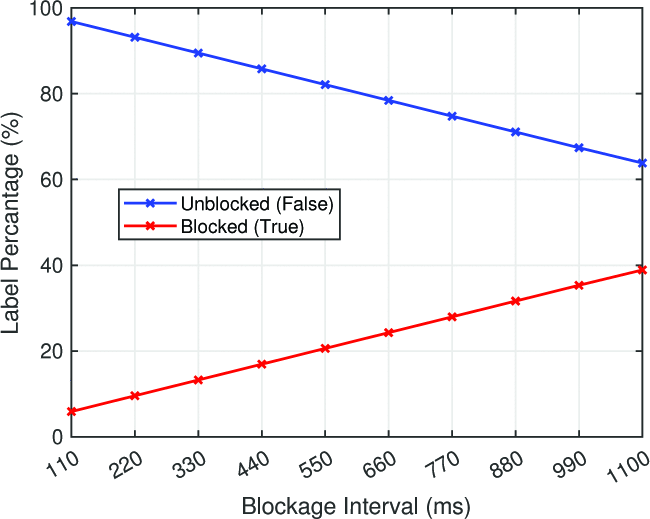

主要贡献：

1. 首次提出利用毫米波FMCW雷达实现<strong>未来链路阻塞</strong>的前瞻性预测，提升高频通信的可靠性。
2. 构建基于 DeepSense 6G 平台的大规模实测数据集，包含超过 <strong>1 万条</strong>雷达与通信联合测量样本。
3. 设计结合 CNN 与 LSTM 的深度神经网络，实现时序雷达图像输入的二分类阻塞预测，提前最多 1 秒预警。
4. 预测精度达到 <strong>90%+ 的准确率和 F1 分数</strong>，模型总参数仅约 18 万，部署代价低。

采用方法：

1. 系统模型：

   基站配备 60GHz 相控阵和 77GHz FMCW 雷达，用户端为静态全向发射；

   采用 block fading 模型建模阻塞事件，雷达每帧周期为 110ms；

2. 数据预处理：

   对雷达 ADC 数据进行 Range、Doppler、Angle FFT，生成 <strong>Radar Cube</strong>；

   求和压缩为二维 <strong>Range-Angle Map</strong>，用于输入深度模型。

3. 模型结构：

   CNN 特征提取（5层卷积+池化）+ LSTM 建模时序特征 + FC 预测层；

   使用 Sigmoid 输出概率并转为二分类结果。

   

   

实验结果：

1. 预测提前 <strong>1 秒</strong>（Tp=10）仍达 <strong>92~97%</strong> 准确率，F1 分数 > 90%；

2. 使用 DeepSense Scenario 30 采集，包含 307 条独立阻塞序列，共 <strong>14624</strong> 个样本点；

3. 最终训练样本为 6965 条，验证 1808 条，测试 907 条，模型参数仅 <strong>184K</strong>。

   

   

局限性：

- 未扩展到动态用户、多用户、多基站场景；
- 未考虑复杂天气或弱反射目标下的鲁棒性问题；
- 目前输入为 Range-Angle Map，未来可探索 Radar Cube 3D建模。