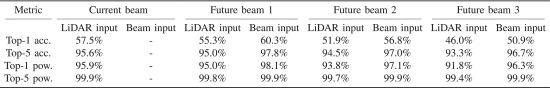

#### 主要贡献：

- 首次在真实大规模数据集中验证 LiDAR 数据用于 **当前与未来** 波束预测的有效性。
- 提出基于 GRU 的编码器-解码器网络，能够根据历史 LiDAR 感知信息预测未来多个时刻的最佳波束。
- 在 DeepSense 6G 场景 8 上进行实测评估，提出方法在 top-5 准确率上达到 **95.6%**（当前波束），未来波束预测保持 >94% 接收功率比。
- 相比基线方法大幅降低了波束训练开销，可实现 **90%+** 的开销节省。

#### 采用方法：

- 系统模型：
  - 静止基站（BS）安装 16 阵列天线与 360° LiDAR；
  - 移动用户设备（UE）为 60 GHz 全向发射器，基站使用 64 波束码本进行通信。
- 数据预处理：
  - 每个采样周期收集一帧原始 LiDAR 点云（460 点）并量化为 **216 角度 bin**；
  - 信道采样间隔为 **128ms**，数据包括 LiDAR 和 64 波束接收功率向量。
- 模型结构：
  - 采用 GRU 编码器-解码器网络，支持 **当前波束预测** 与 **未来 v 步预测**；
  - 输入：长度为 `W=8` 的 LiDAR 序列，输出：`V+1=4` 个当前及未来波束；
  - 每一帧 LiDAR 经 FC 层降维至 64-d 向量后输入 GRU，输出经 softmax 分类器预测 beam。

#### 实验结果：

- **当前波束预测**：top-5 准确率为 **95.6%**；

- **未来第一帧预测**：top-5 准确率为 **95.0%**，top-1 相对功率保持 >94%；

- **与基线比较**：仅需使用 10.4% 的 beam training 开销即可达到相似精度；

- 模型推理速度为 **1.38ms（CPU）**，具备实际部署可行性。

  

#### 局限性：

- 当前研究聚焦单用户场景，尚未扩展至多用户系统；
- LiDAR 在极端天气（雨、雾）下性能下降，需考虑多模态增强；
- 模型依赖精确同步的 LiDAR 与通信数据，实际部署需进一步验证。

#### 代码复现记录报告

本项目的核心任务是基于输入的历史雷达数据（时间序列），预测未来几步的光束数据。具体地，作者使用 GRU 网络来处理雷达数据的时间依赖关系，并对未来的光束进行多类别分类预测。

**数据集：**

本任务使用的数据集来自deepsense 6g数据集中的场景8,通过此处[下载](https://www.deepsense6g.net/scenario-8/)。该数据集来自雷达传感器，包含了时间序列的激光雷达数据和对应的光束数据。数据集包括以下几种主要信息：

- **unit1_pwr_60ghz：** 60GHz雷达单元的功率数据。

- **unit1_lidar_SCR：** 激光雷达的 SCR 数据。

- **seq_index：** 数据序列的索引，表示数据的时间步。

- **Beam 数据：** 对应时间步的光束数据，通常是从雷达信号中提取的不同类别的信息。

**数据处理：**

数据预处理代码存放在`gen_data_seq.py`文件中，运行该代码会对数据集进行划分，train与test比例为8：2。

1. **数据切分：** 将数据按照时间序列切分为固定长度的输入序列（$T=8$）和输出序列（$K=3$）。
2. **特征选择：** 选择有意义的特征（如雷达功率数据和激光雷达数据）作为输入。
3. **标签处理：** 使用最大功率索引作为光束的标签，进行多类别分类。

**模型架构：**

模型定义在`model.py`文件中，采用了一层GRU进行时序预测：

```python
class GruModel(nn.Module):
    def __init__(self, num_classes, num_layers=1, hidden_size=64, embed_size=64):
        super(GruModel, self).__init__()
        self.embed = torch.nn.Linear(216, embed_size)
        self.num_layers = num_layers
        self.hidden_size = hidden_size
        self.gru = torch.nn.GRU(input_size=embed_size, hidden_size=hidden_size, num_layers=num_layers, dropout=0.8)
        self.fc = torch.nn.Linear(hidden_size, num_classes)
        self.name = 'GruModel'
        self.dropout1 = nn.Dropout(0.5)

    def initHidden(self, batch_size):
        return torch.zeros((self.num_layers, batch_size, self.hidden_size))

    def forward(self, x, h):
        y = self.embed(x)
        y = self.dropout1(y)
        y, h = self.gru(y, h)
        y = self.fc(y)
        return y, h
```

**训练过程：**

模型的训练与评估代码均存放在`train_model.py`文件中，只需要运行便可得到结果，评价指标选取Top-K。

**结果分析：**

| **Top-k Accuracy** | **Epoch 1** | **Epoch 2** | **Epoch 3** | **Epoch 4** |
| ------------------ | ----------- | ----------- | ----------- | ----------- |
| **Top-1 Accuracy** | 58.06%      | 55.86%      | 52.75%      | 46.15%      |
| **Top-2 Accuracy** | 78.02%      | 76.19%      | 72.53%      | 69.41%      |
| **Top-3 Accuracy** | 87.73%      | 85.90%      | 82.60%      | 79.30%      |
| **Top-5 Accuracy** | 94.69%      | 94.14%      | 92.86%      | 91.58%      |