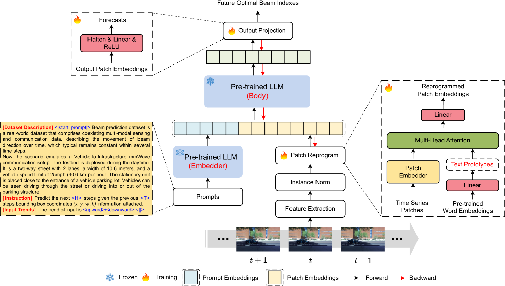

#### 主要贡献

该论文提出了一个名为 BeamLLM 的创新框架，它利用大型语言模型（LLMs）来增强毫米波（mmWave）波束预测的准确性和鲁棒性 。该框架将计算机视觉（CV）与LLMs的跨模态推理能力相结合，从RGB图像中提取用户设备（UE）的位置特征 。它通过重新编程技术，将视觉-时间特征与LLMs的语义空间对齐 。

#### 采用方法

1. **视觉数据特征提取模块**：该框架首先使用YOLOv4对象检测器来处理原始RGB数据 。YOLOv4用于识别RGB图像中的UE并提取边界框向量，其中包括检测对象的中心坐标、宽度和高度 。这些边界框向量序列被用作视觉特征 。
2. **主干模块 (Backbone Module)**：为了使LLM能够处理视觉特征，BeamLLM采用了重新编程（reprogramming）技术，该技术包含两个关键步骤：
   - **适应（Adaptation）**：通过补丁重新编程（patch reprogramming）模块，将时间序列输入数据映射到自然语言处理（NLP）任务中，以便LLM能够有效处理不同模态的输入 。
   - **对齐（Alignment）**：通过“提示作为前缀”（Prompt-as-Prefix, PaP）模块，使用自然语言提示作为前缀来丰富输入上下文，并指导LLM对重新编程后的补丁进行转换 。提示包含数据集描述、任务描述和输入趋势等关键信息 。
3. **学习阶段**：BeamLLM在训练期间冻结了LLM主干模型的参数 。模型以监督方式进行训练，使用图像输入和对应的真实最佳波束索引对 。波束预测被视为一个时间序列预测任务，其中每个时间步都对应一个分类任务 。模型参数通过最小化交叉熵损失进行优化 。

#### 实验结果

- **数据集**：该框架在DeepSense 6G数据集上进行评估 。该数据集是一个来自真实世界的V2I（车对基础设施）毫米波通信场景的多模态数据集 。
- **标准预测**：在标准预测任务中，BeamLLM的Top-1准确率达到61.01%，Top-3准确率达到97.39%，表现优于传统的深度学习模型（如RNN、GRU和LSTM） 。
- **小样本预测（Few-shot Prediction）**：在小样本预测场景中，BeamLLM的表现优于所有基线方法 。在时间样本从1到10的预测中，其性能下降仅为12.56% (Top-1) 和5.55% (Top-3)，而LSTM模型的Top-1准确率下降了16.48%，Top-3准确率下降了11.58% 。
- **消融研究**：结果表明，集成了PaP模块的BeamLLM与没有使用PaP的模型相比，在Top-1准确率上平均提升了5.81%，在Top-3准确率上平均提升了3.62%，这证明了PaP在该任务中的有效性 。

#### 局限性

尽管性能有所提升，但BeamLLM也存在局限性 。模型的参数规模巨大，导致推理复杂度增加 。虽然在训练过程中LLM主干模型被冻结，但可训练参数的数量仍然相当可观 。此外，BeamLLM的平均推理时间高于传统模型，这会带来更高的部署成本 。论文指出，实际部署需要权衡模型复杂性和实时性约束，可能需要采用模型压缩或轻量化架构设计等加速方法 。