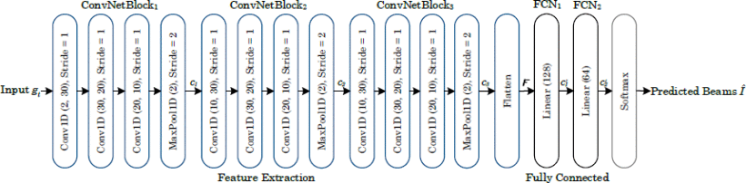
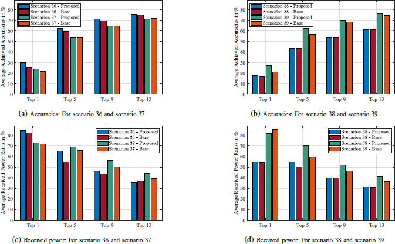

#### 主要贡献：

- 提出了基于深度学习的解决方案，利用车辆位置数据预测适用于60 GHz毫米波（mmWave）车辆间通信（V2V）的最佳波束，从而减少传统毫米波通信中的波束搜索开销。
- 通过分析车辆位置数据，选择提供足够接收功率的波束，确保最佳的视距链接，以提高通信性能。
- 在真实世界的毫米波传感和通信数据集上验证了该方案，取得了较为理想的结果，平均接收功率比为84.58%。

#### 采用方法：

- 使用深度学习模型，通过接收来自GPS传感器的车辆位置数据来预测最优波束。该方法通过减少波束搜索空间，大幅降低了波束选择过程中的计算和延迟开销。

- 深度学习模型采用卷积神经网络（CNN），包含多个卷积块、全连接层和Softmax层。模型通过位置数据预处理后，输出前M个预测波束，其中包含最佳波束。

  

#### 实验结果：

- 在四种不同的场景下进行了实验，分别为场景36（24,800个样本）、场景37（31,000个样本）、场景38（36,000个样本）和场景39（20,400个样本）。实验表明，提出的方法在Top-M波束预测准确率上优于基线方法（例如，Top-1准确率提高了19.67%）。另外，在接收功率比方面，Top-1波束预测的平均接收功率比为84.58%。

  

#### 局限性：

尽管该方法减少了波束选择过程中的开销，但其性能仍然受到车辆运动、环境变化等动态因素的影响，尤其是在高度动态的场景中，预测的波束可能会出现误差。

未来的工作可以进一步集成更多的传感信息并进行模型融合，以提高准确度和鲁棒性。