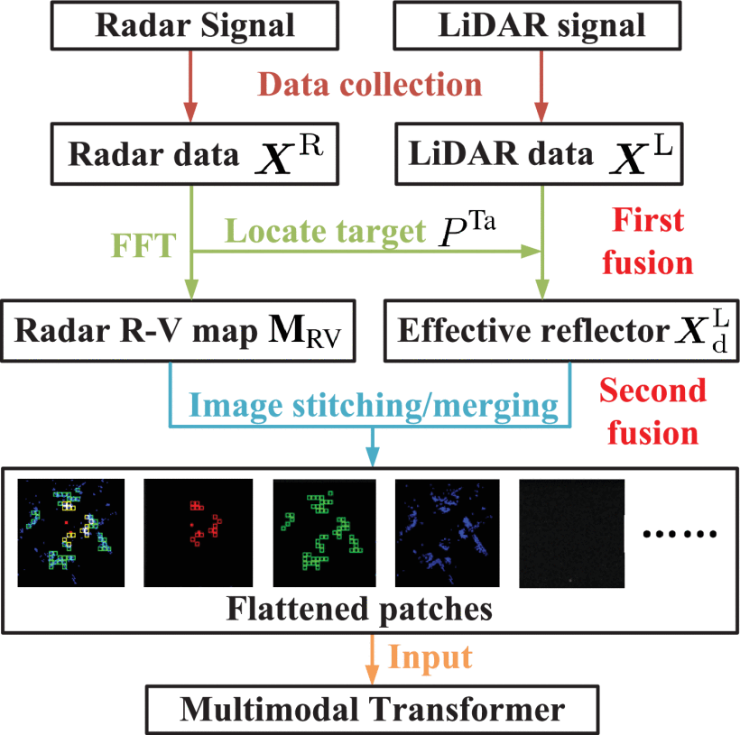

#### 主要贡献：

1. 设计一种多模态融合框架，结合雷达的移动性和激光点云的语义信息，来减少波束成型开销。
2. 多模态融合分为两步进行。第一步将雷达数据假定为先验知识来构建环境语义信息，第二步将雷达数据和激光点云数据进行融合。
3. 利用最佳波束出现的频率作为先验知识来进行剪枝，消除不太可能的波束方向。
4. 使用多种不同的配置对上述方案进行评估。

#### 采用方法：

在进行此任务时有两个主要挑战：

挑战一：多模态数据的融合可以在三个层面上进行，第一是原始数据进行融合，它的好处是它保留了最原始的信息，然而这个融合策略对计算和存储有着一定的要求；第二是决策级融合，就是在最后的阶段整合单独的决策结果，因此一些感知信息可能无法得到充分的利用；第三是特征级融合，就是从不同的传感器数据中提取特征并进行融合，这个策略对计算和存储的要求较小。

挑战二：如何设计神经网络，于类似图像的数据，卷积神经网络 （CNN） 通常具有良好的性能。然而，CNN 倾向于关注局部特征，确定其超参数通常需要进行多次试验。因此，决定将 Transformer 视为深度神经网络。与其他类型的深度神经网络相比，Transformer 可以捕获全局特征，以及长期和长期依赖关系。此外，transformer支持并行计算以加快收敛过程。

具体选择的多模态融合策略如下图所示：

**雷达数据处理：**

从雷达信号中提取车辆的运动参数（距离、速度、角度），作为先验信息辅助 LiDAR 数据处理。构建**距离-速度图 (R-V map)** 或 **距离-角度图 (R-A map)**，用于表示目标轨迹信息。

**LiDAR数据处理：**

提取对无线电波传播最有影响的“有效反射体” (effective reflectors)，捕捉环境语义信息。

三步处理：

1. 范围限制与降维：限制点云的空间范围，并将三维点投影到二维平面。
2. 点云分割与反射体识别：将二维点云分成网格，筛选点数超过阈值的格子作为潜在反射体。
3. 有效反射体选择：基于发射机、目标位置与障碍物的几何关系，通过路径长度优化 + 障碍数限制，保留最重要的反射体。

**第一步融合：**

特征级融合（Feature-level Fusion）。利用**雷达先验（R、V、A）**信息，将 LiDAR 点云筛选、配准到相同坐标系，并只保留与当前通信路径相关的反射体。输出为一个较小的“有效反射体集”，大幅减少 LiDAR 点云冗余，提高计算效率。

**第二步融合：**

将雷达图像（R-V 或 R-A 图）与 LiDAR 处理结果（二维点云、潜在反射体图、有效反射体图）组合成多模态输入。

数据集成方法：

1. 图像拼接 (Image Stitching)：在空间维度直接拼接多模态图像形成大图。
2. 图像合并 (Image Merging)：在通道维度合并不同模态图像的 RGB 通道。

输入到多模态 Transformer (MMT)：

- 将融合后的图像切分为 patch → 线性投影 → 位置编码 → Transformer 编码器。
- 输出预测最优波束索引集合（Top-k Beam Indices）。

#### 实验结果：

不同多模态数据融合方案的波束预测精度比较：

#### 局限性：

**1. 数据与场景的局限性**

- 实验仅在 **DeepSense 6G 数据集的一个场景（Scenario 31）** 上验证，场景多样性不足。
- 环境和车辆分布的多样性不够，可能导致模型泛化到其他城市布局、天气条件或交通密度时性能下降。
- 依赖 **高质量同步的雷达和 LiDAR 数据**，实际部署中可能受传感器不同步、噪声和遮挡影响。

**2. 算法与计算复杂度**

- 多模态 Transformer (MMT) 的计算复杂度 **远高于 CNN**（数量级 10910^9109 FLOPs vs 10610^6106 FLOPs），虽然延迟在实验设备上可接受，但在边缘设备或低功耗基站中可能成为瓶颈。
- MMT 对硬件显存和处理能力要求高，且 batch size、patch size 的选择会影响性能。

**3. 先验依赖与传感器融合限制**

- 第一阶段融合强依赖雷达先验（R、V、A）来筛选 LiDAR 点云，**一旦雷达检测误差较大，可能会导致有效反射体提取错误**，从而影响后续预测。
- 没有充分讨论当 LiDAR 数据缺失或严重噪声时的鲁棒性。
- 传感器安装位置、标定误差、时间同步误差等实际问题未深入考虑。

**4. 功能扩展与适应性不足**

- 仅考虑了单目标预测，未在多目标动态场景下进行全面验证（虽然在结论部分提到未来会扩展）。
- 没有融合额外信息（如 GPS、IMU、摄像头），在实际复杂通信环境下，单纯依赖雷达+LiDAR 可能不够稳健。
- 没有探讨对 mmWave 阵列规模变化（如天线数变化）或波束码本变化的适应性。

**5. 通信与环境变化适应性**

- 实验假设波束统计分布相对稳定（用于 beam pruning），但在高速变化或新环境中，这个先验可能不再成立。
- 没有考虑极端天气（雨、雾、雪）对 LiDAR 性能的退化问题。