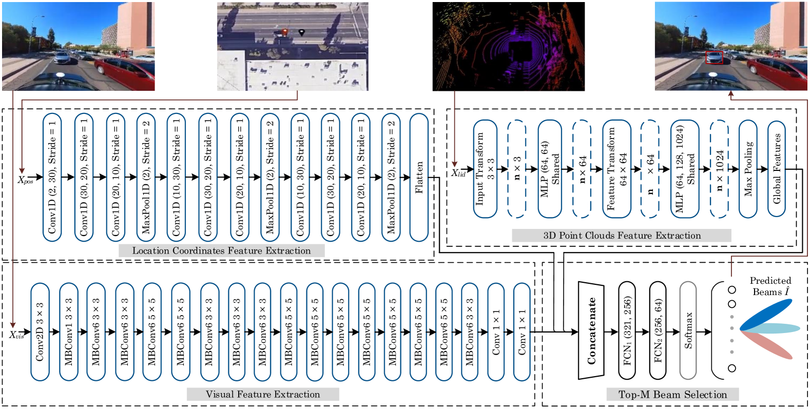
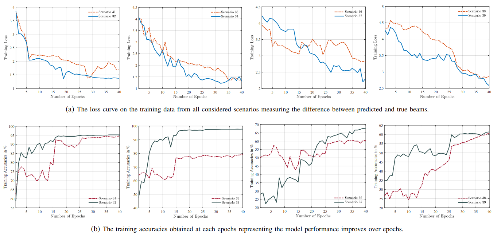
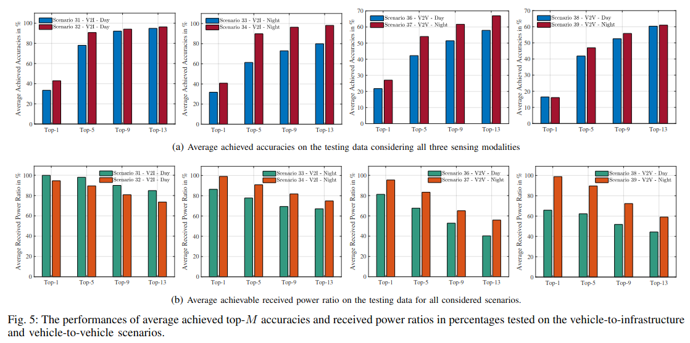

#### 主要贡献：

1. 提出一个基于深度学习的多模态感知波束预测方法，面向 5G-NR 标准，能够预测一组最优子集波束，而不是通过标准的穷举波束扫描。这种方式显著减少了波束搜索空间与扫描延迟，在 mmWave 高动态场景下尤其有用。
2. 综合利用多种感知信息（如车辆位置数据、不同传感器模态），以弥补单一模态在误差与信息缺失方面的不足。特别是使用位置数据来帮助识别城市场景中的目标车辆。
3. 方案依赖于普遍可用的车载和路侧传感器（非专用昂贵硬件），降低了部署复杂度与成本。
4. 实验数据不是仿真（如射线追踪），而是来自真实环境的 V2I 与 V2V 场景，考虑了车辆的移动性。通过 **预测精度（Accuracy）** 和 **接收功率比（Received Power Ratio）** 两个指标验证了方法有效性。
5. 与 5G-NR 标准兼容，并展示了集成后的好处：波束搜索空间减少 **79.67%**，搜索时间减少 **91.89%**（Top-13 波束情况下），在 Top-13 波束预测中准确率可达 **98.19%**，显著优于传统穷举扫描。

#### 采用方法：

作者的方法核心是基于多模态感知数据的深度学习波束预测框架，包含数据预处理、多模态特征提取和Top-M波束选择三个主要步骤，模型结构图如下：

**数据预处理：**

为了让不同模态的数据适配统一的神经网络输入，并降低计算复杂度，作者对三类感知数据进行了归一化、尺寸固定化等处理：

1. 针对位置数据，将经纬度从原来的十进制度数映射到$[-1, 1]$返回进行归一化，结果是一个在笛卡尔坐标系下的标准化矩阵。
2. 针对视觉数据，将图像尺寸统一为$224\times224\times3$，对RGB三个通道分别按照ImageNet标准均值和方差进行归一化（零均值、单位方差）。
3. 针对点云数据，将每帧点云统一为15000个点，不足则零填充，过多则随即下采样，保留三维坐标信息。

**多模态特征提取：**

每种模态独立经过一个深度学习子网络提取特征：

1. 位置信息特征提取使用一个一维神经网络结构，三个连续的 Conv1D + MaxPooling 块，用于逐步提取局部时序/空间特征，并降维防止过拟合，最后通过 Flatten 层将特征展平成一维向量。
2. 视觉特征的提取采用Fine-tuned EfficientNet-B0。
3. 点云特征的提取采用Fine-tuned PointNet。

**Top-M波束选择：**

将三种模态特征向量沿特征维拼接（Concatenate）成一个综合特征向量。经过两个全连接层（FCN1, FCN2）进行特征融合和非线性映射。通过**Softmax**得到 64 个候选波束的概率分布。选取概率最高的 **Top-M 波束** 作为预测结果，实现显著减少波束搜索空间和延迟。

#### 实验结果：

实验数据来源于 DeepSense 6G dataset。使用场景包括：

- **V2I**（车到基站）：Scenario 31, 32, 33, 34
- **V2V**（车到车）：Scenario 36, 37, 38, 39

样本数量：

- 31：7,012
- 32：3,235
- 33：3,981
- 34：4,439
- 36：24,800
- 37：31,000
- 38：36,000
- 39：20,400

数据划分：每个场景 60% 训练 / 20% 验证 / 20% 测试。

由上述结果可以看出随 Epoch 增加逐渐下降，表示预测与真实波束差异减小，准确了曲线逐渐上升，说明模型学习到有效特征。

上述为不同场景下的 Top-K 准确率。

#### 局限性：

该方法虽然在 LoS 场景中效果显著，但在跨场景泛化、NLoS 适应、感知数据鲁棒性、端到端性能验证以及标准化集成等方面仍存在明显不足。