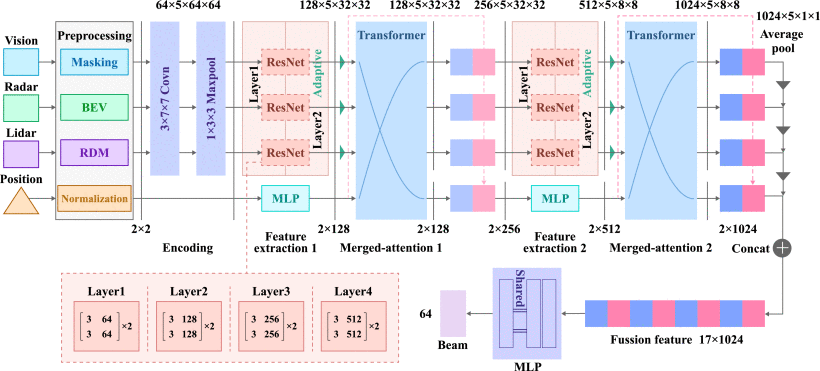

#### 主要贡献：

- 提出了一种基于Transformer的波束赋形方法，以解决传统波束码本在高速移动和复杂路况下因波束失准和信道衰落而失败的挑战 。
- 引入了多样化的数据预处理和编码方案，以处理异构数据，确保每种模态都能做出有意义的贡献 。
- 采用了一种创新的神经网络结构，结合了3D卷积和Transformer，利用残差块进行特征提取，并利用融合注意力机制进行特征融合，从而实现高可靠性的波束赋形 。
- 利用真实世界的多模态数据库验证了该算法的有效性，证明了所提方法的可靠性 。

#### 采用方法：

- **数据处理：** 该方法使用了来自基站传感器的多模态数据，包括视觉（相机）、雷达、LiDAR和位置（GPS）信息 。对不同模态的数据进行了专门的预处理，例如对视觉数据进行模糊、增强和分割，将LiDAR点云数据转换为鸟瞰图（BEV）图像，对雷达数据进行多普勒信息估计和生成距离-多普勒矩阵，以及对GPS数据进行坐标转换和归一化 。

- **模型架构：** 采用基于3D ResNet-18的模型来提取图像、点云和雷达的特征 。

- **特征融合：** 利用Transformer的融合注意力机制将提取出的多模态特征进行融合，以提高波束赋形的适应性和泛化能力 。

  

#### 实验结果：

该方法在真实世界的多模态数据上进行了实验 。结果显示，所提出的方法实现了平均91.59%的top-3准确率 。与单模态方案相比，在高速移动环境下，该方法的top-1准确率提高了30%以上 。

#### 局限性：

传统的单模态波束赋形方案在面对恶劣天气（如大雨、雪和雾）时，容易因环境对信号的衰减、散射或吸收而导致传感和波束赋形过程的准确性降低 。

单纯依赖通信回波的角度或距离估计可能易受多径效应影响，导致“鬼影目标”出现，从而降低波束赋形精度和可靠性 。

单模态数据可能会限制波束赋形结果的准确性和丰富性，并且更容易受到环境噪声或干扰的影响 。